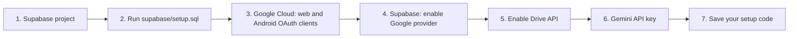
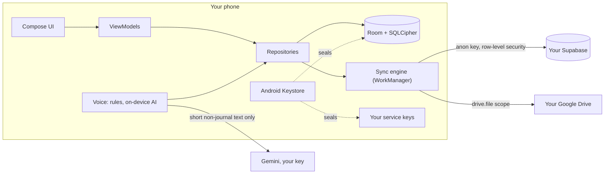

<p align="center">
  
</p>

# Cove

A calm, voice-first companion for Android. Alarms, to-dos, habits, money, a journal and a morning brief, all by voice, all working offline on an encrypted on-device database.

Cloud features are **bring your own**: sync through your own Supabase project, files in your own Google Drive, smarter voice with your own Gemini key. No keys ship with the app, and nothing is sent anywhere you haven't set up yourself.

> Cove is a private, sideloaded app built for one user. Running cost is about zero.

## What it does

| | |
|---|---|
| **Alarms and nudges** | Gentle-rise alarms, bedtime wind-down, bundled reminders |
| **To-dos and plan** | Categories, schedule view, "one thing" focus mode |
| **Habits and training** | Daily habits with streaks, a simple weekday workout plan |
| **Money** | Spending by category and budget; payments can be read from bank and wallet SMS, on your phone only |
| **Journal** | Text, photos and voice notes in one entry, searchable |
| **Morning brief** | A spoken summary of your day, ready by your wake time |
| **Voice** | Say "add milk to my to-dos" or "I spent 250 on lunch". Rules first, on-device AI where available, Gemini optional |
| **Widgets and tiles** | Home-screen widgets, a Quick Settings tile and a launcher shortcut that opens straight into listening |

## Privacy and security

- The database is encrypted with SQLCipher (AES-256). Its key is sealed by a non-exportable Android Keystore key and never leaves the phone.
- Optional biometric app lock, with content hidden in recents and screenshots.
- Service credentials you enter are stored encrypted, outside backups and logs.
- Journal text and long transcripts are never sent to any AI service. Gemini only ever sees short, non-journal text such as a spoken command.
- Supabase tables use row-level security, so each signed-in user only ever sees their own rows.

Details, including the honest trade-offs of the lock design: [`docs/SECURITY.md`](docs/SECURITY.md).

## Quick start

Requirements: JDK 17, Android SDK 36, and a device or emulator on Android 12+ (minSdk 31).

```bash
git clone git@github.com:maskmanlucifer/Cove.git
cd Cove
./gradlew :app:installDebug      # build and install on the connected device
```

**No credentials are needed to build or run.** Without any setup, everything local works: alarms, to-dos, habits, money, journal, widgets, app lock and the rule-based voice assistant. Cloud features switch on as you connect them.

## Bring your own services

Every service is optional, and you can add them in any order after Supabase. You paste values into **Me > Connect services** in the app. They are stored encrypted on that phone only. Each sheet has an **Open dashboard** button and a **Test connection** button that explains problems in plain words.

| Service | Gives you | You need |
|---|---|---|
| **Supabase** | Sync between devices | A free Supabase project |
| **Google sign-in** | Proves the data is yours | A Google Cloud project (free), plus Supabase |
| **Google Drive** | Photos, voice notes, monthly backup | The same Google Cloud project |
| **Gemini** | Trickier voice commands, brief wording | A Google AI Studio API key (free plan is enough) |
| Weather (Open-Meteo) | Brief weather | Nothing |



### 1. Supabase (sync)
1. Create a project at [supabase.com/dashboard](https://supabase.com/dashboard) and leave **Enable Data API** on.
2. In **SQL Editor**, run [`supabase/setup.sql`](supabase/setup.sql). It creates every table with row-level security and is safe to run twice. In the app you can also tap **Copy setup SQL**.
3. In **Project Settings > API**, copy the **Project URL** and the **anon** key (starts `eyJ`; a `sb_publishable_…` key also works). **Never** use `service_role` or a secret key. The app refuses them.
4. Paste both in the app and tap **Test connection**.

### 2. Google sign-in and Drive
1. In [Google Cloud console](https://console.cloud.google.com), create a project and fill in the **OAuth consent screen**. Either publish the app, or stay in *Testing* and add your account under **Test users** (in Testing, Google signs you out every 7 days).
2. Create an OAuth client of type **Web application**. Copy its **Client ID** and **secret**.
3. Create a second client of type **Android** with package `app.cove.companion` and your build's **SHA-1**. The app shows it under Connect services > Google Drive, or run `./gradlew signingReport`. Debug and release builds have different SHA-1s, so add one client per build you use.
4. In Supabase, go to **Authentication > Providers > Google**, enable it, and paste the web Client ID and secret.
5. In the app, paste the **web** Client ID (not the Android one) and tap **Sign in**. The phone needs a Google account added in Android settings.
6. For Drive, enable the **Google Drive API** in the same project, then tap **Connect Drive**. Cove can only touch files it created (`drive.file` scope).

### 3. Gemini
Create a key at [aistudio.google.com/apikey](https://aistudio.google.com/apikey), paste it under Connect services > Gemini, and tap **Test connection**. If you ever turn billing on, set a budget alert.

### Setup code and new phones
Android deletes stored connections when the app is uninstalled, moved to a new phone, or installed with a different signing key (debug and release differ). Before that, open **Connect services > My setup code** and copy or save it. On the new install, paste it and everything is filled in at once. `tools/make-setup-code.py` can also build one from your values. **Treat the code like a password: it contains your keys.**

The full walkthrough, with troubleshooting: [`docs/SETUP.md`](docs/SETUP.md).

## Building a release

A release build is minified with R8 and signed with your own key.

```bash
keytool -genkeypair -v -keystore cove-release.jks -alias cove -keyalg RSA -keysize 4096 -validity 10000
cp keystore.properties.example keystore.properties     # then fill in your passwords
./gradlew :app:assembleRelease                         # app/build/outputs/apk/release/app-release.apk
adb install -r app/build/outputs/apk/release/app-release.apk
```

Keep the `.jks` backed up: losing it means you can't update an installed release in place. `keystore.properties` and `*.jks` are git-ignored. Without them, release builds fall back to the debug key and are not suitable to distribute. More in [`docs/RELEASE.md`](docs/RELEASE.md).

Optional: `supabaseUrl`, `supabaseAnonKey` and `googleWebClientId` in `~/.gradle/gradle.properties` become build-time defaults. Values entered in the app always win.

## How it fits together



**Stack:** Kotlin, Jetpack Compose, Room with SQLCipher, Ktor, WorkManager, Glance widgets, ML Kit GenAI, manual dependency injection.

All code is in `app/src/main/kotlin/app/cove/companion/`:

| Package | What lives there |
|---|---|
| `CoveApp`, `AppContainer`, `MainActivity` | Entry point, dependency graph, single activity with the lock gate |
| `core/` | Clock, formatting, notification channels, permissions, ViewModel helpers |
| `design/` | Colour tokens, type scale, shapes, icons, shared components, code-drawn illustrations |
| `navigation/` | Routes, nav host, tab host |
| `resilience/` | Crash notes, crash-loop rule, database guard, safe mode |
| `security/` | SQLCipher open helper, Keystore-wrapped key, plaintext-to-encrypted migration |
| `ai/` | `AiService` facade, router and policy, providers (on-device, cloud, rules) |
| `data/` | Room, repositories, sync over Supabase, auth, Drive, media, backup, search |
| `feature/` | One package per screen area: today, plan, habits, money, journal, me, alarms, voice, brief, widgets and more |

The backend lives in [`supabase/`](supabase/): `setup.sql`, numbered migrations, and an optional `ai-gateway` Edge Function.

## Develop

```bash
./gradlew :app:testDebugUnitTest   # JVM unit tests
./gradlew :app:lintDebug           # lint
```

Debug builds accept `adb` extras for sample data, a frozen clock, jumping to any screen and more. See [`docs/DEBUG.md`](docs/DEBUG.md). Release builds ignore them.

## Docs

| | |
|---|---|
| [`PLAN.md`](PLAN.md) | Product and architecture plan, decisions, phases |
| [`docs/SETUP.md`](docs/SETUP.md) | Connect your own Supabase, Google, Drive and Gemini |
| [`docs/RELEASE.md`](docs/RELEASE.md) | Signing, release builds, R8 rules, lint notes |
| [`docs/SECURITY.md`](docs/SECURITY.md) | Database encryption and app lock |
| [`docs/RESILIENCE.md`](docs/RESILIENCE.md) | What happens when the database, key or app fails |
| [`docs/DATA_CONTROLS.md`](docs/DATA_CONTROLS.md) | Clear all data, and how updates keep your connections |
| [`docs/AI.md`](docs/AI.md) | The AI layer and what is sent where |
| [`docs/CATEGORIZATION.md`](docs/CATEGORIZATION.md) | How expenses are filed |
| [`docs/SMS_IMPORT.md`](docs/SMS_IMPORT.md) | Payments from messages: parsing, dedupe, privacy |
| [`docs/JOURNAL.md`](docs/JOURNAL.md), [`docs/TRAINING.md`](docs/TRAINING.md) | Journal blocks, workout plan |
| [`docs/CONTRIBUTING.md`](docs/CONTRIBUTING.md) | How features are built and verified |
| [`docs/DEBUG.md`](docs/DEBUG.md) | Debug extras and developer tools |
| [`supabase/README.md`](supabase/README.md) | Backend files |
